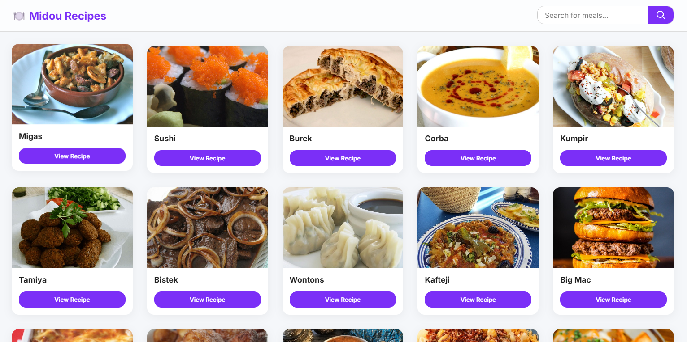
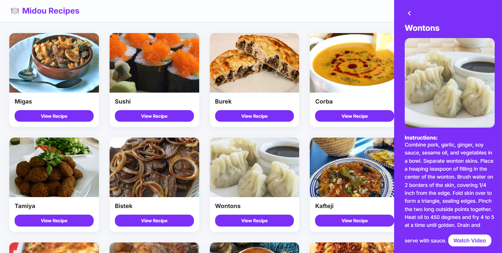

# 🍽️ Midou Recipes – Modern Recipe App

A modern and responsive web app that allows users to search for meals and view detailed recipes using [TheMealDB API](https://www.themealdb.com/). Built with **vanilla HTML, CSS, and JavaScript**.

---

## 🔍 Features

- 🔎 **Search Meals**: Enter any dish name to search for related recipes.
- 📋 **Recipe Cards**: View meals with thumbnails and quick access buttons.
- 📖 **Recipe Details Panel**: See full cooking instructions and a YouTube video (if available).
- 📱 **Responsive Design**: Optimized layout for both desktop and mobile screens.
- 💅 **Modern UI**: Glassmorphism effects, clean design, and smooth interactions.

---

## 📸 Preview

  


> You can also [view the live demo here](https://midou-recipes.vercel.app)

---

## 🚀 Getting Started

### 1. Clone the Repository

```bash
git clone https://github.com/Midou-Mni/Recipes.git
cd Recipes
